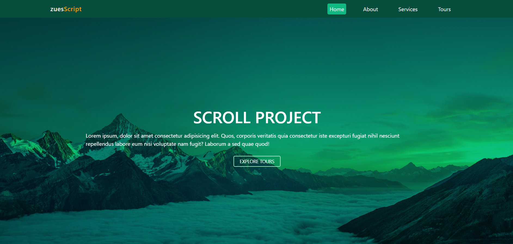
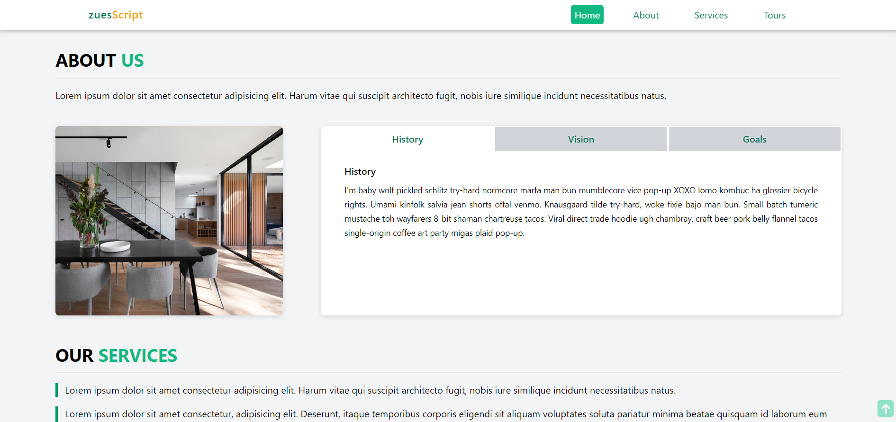

# Scroll Project

## Frontend

A dummy homepage with minimalistic design created to test navigation bar page scroll functionalities with javascript.
Other functionalities include: Horizontal image scroll, Dynamic date at footer(changes date automatically when its the new year), tab toggle. 

# SCREENSHOTS

1

2

3

Site link: https://zeus-kronos.github.io/scroll-project/

Developed with
| Visual Studio Code | | HTML | | Taiilwind CSS (A CSS Framework) | | Javascript |

Author
Gabriel Dan
